Naturalistic-Dynamic-Network-Toolbox(NaDyNet)


## **1. Software Overview**

NaDyNet is a MATLAB-based GUI software designed for analysing task-based fMRI data under naturalistic stimuli (also applicable to resting-state fMRI data), aiming to advance naturalistic scene neuroscience.

**Naturalistic stimuli** refer to rich and continuous stimuli such as watching movies or listening to stories. This paradigm represents an emerging trend in brain science research. Unlike block or event-related designs, continuous-stimulus fMcRI signals are challenging to analyse using traditional GLM methods. NaDyNet provides dynamic analysis methods capable of real-time brain network and activation analysis.

**Naturalistic stimuli** refer to rich and continuous stimuli such as watching movies or listening to stories. This paradigm represents an emerging trend in brain science research. Unlike block or event-related designs, continuous-stimulus fMRI signals are challenging to analyze using traditional GLM methods. NaDyNet provides dynamic analysis methods capable of real-time brain network and activation analysis.

NaDyNet offers K-means clustering analysis to determine the optimal K value, visualizing multiple clustered states and their corresponding state transition matrices.

## 2. Hardware and Software Requirements

### **2.1 Hardware Requirements**

This toolbox is a MATLAB-based software for analyzing fMRI (functional magnetic resonance imaging) data. Due to the large size of fMRI data, a minimum of **16GB RAM** is required. Methods such as SWISC, CAP, and ISCAP are particularly memory-intensive; for example, the paranoia dataset (22 subjects, 1310 frames per subject) requires **128GB RAM** to run. Other methods have lower memory demands.

Additional hardware requirements: Your computer must support MATLAB 2018a or later versions.

### **2.2 Software Requirements**

To run this MATLAB toolbox, the following software environment is required:

1. **Operating System**: Windows 7 or later

2. **Network Environment**: No specific requirements

3. **Platform**: MATLAB 2018a or later

4. **MATLAB Toolboxes**: The following toolboxes must be installed:

   **(1) Medical Imaging Toolbox**: A default MATLAB toolbox for image processing (usually pre-installed). Verify its presence by running:

```matlab
>> which niftiread
C:\Program Files\MATLAB\R2022b\toolbox\images\iptformats\niftiread.m
```


​	(2) [SPM](https://www.fil.ion.ucl.ac.uk/spm/software/download/): Used for reading/writing and manipulating fMRI files.

​	(3) [Group ICA Of fMRI Toolbox (GIFT)](https://github.com/trendscenter/gift)：For data analysis.

​	(4) [BrainNet Viewer](https://www.nitrc.org/projects/bnv/)： used for 3D NII file visualization and image export.

​	(5) [DCC](https://github.com/canlab/Lindquist_Dynamic_Correlation):  

​	(6) [GLKF](https://github.com/PscDavid/dynet_toolbox): 

​	(7) [CAP_TB](https://c4science.ch/source/CAP_Toolbox/):

Toolboxes 2–7 can be downloaded via their respective hyperlinks. Alternatively, a bundled download is available [here](https://pan.baidu.com/s/1Fw_xOWI4y7hVJtVafRQWPQ?pwd=k2tm).

After installing the toolbox and its dependencies, add all toolbox paths via *MATLAB Home > Set Path*. Launch the software by running:

```matlab
NaDyNet
```

For convenience, an alias is also supported.

```matlab
NDN
```


## **3. Software Features and Interface**

The main interface comprises three modules: **Data Extraction**, **Method Selection**, and **Clustering & Visualization** (Figure 1).


In the **ROI TC Extraction Module**, we can organize a group of subjects' fMRI files into a designated folder following a specific naming convention. Then, by selecting a user-defined **Regions of Interest (ROI) mask**, we extract the ROI time series for these subjects and save them to a user-specified output path.

In the **Method Selection Module**, two analysis approaches are available:

1. **ROI-Based Methods**: These methods focus on **predefined regions of interest (ROIs)** for dynamic brain network analysis.
2. **Grey Matter Voxel-Based Methods**: These methods analyze the entire brain or grey matter at the **voxel level**.

If you choose the **Grey Matter Voxel-Based Method**, you can skip the first step (ROI time series extraction).

**Clustering & Plotting Module**:

- Use the **Best K** function to determine the optimal number of clusters (K).
- Alternatively, manually set a K value to perform clustering on dynamic brain network analysis results.
- The tool will generate **K cluster centers (states)**, visualize them, and plot the **state transition matrix** for the subject group.


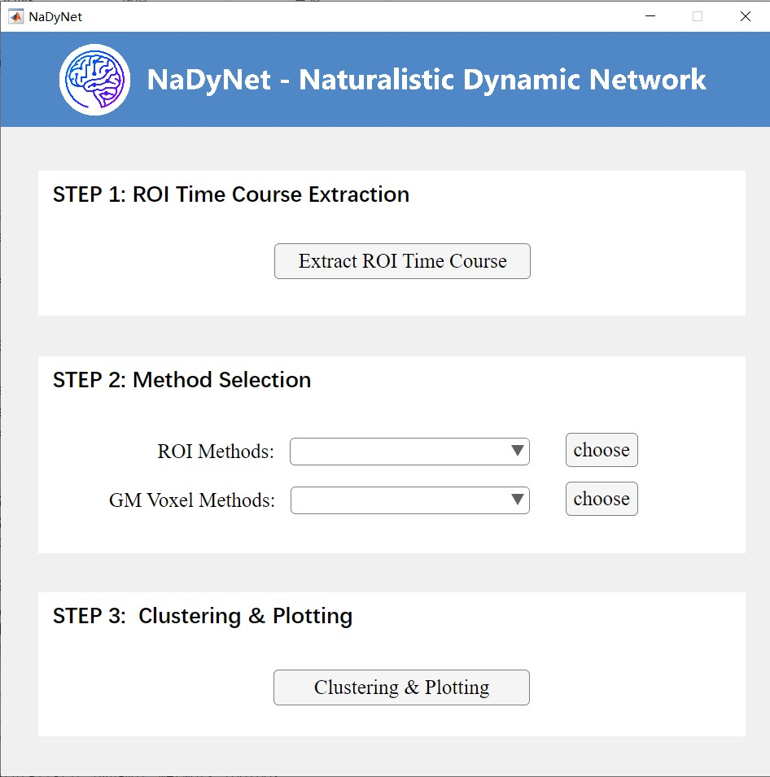

<center style="font-weight: 700">Figure 1. Main Interface</center>

### **3.1 **Data Extraction Module

Click *Extract ROI Time Course* in *Step 1* to access this module (Figure 2).

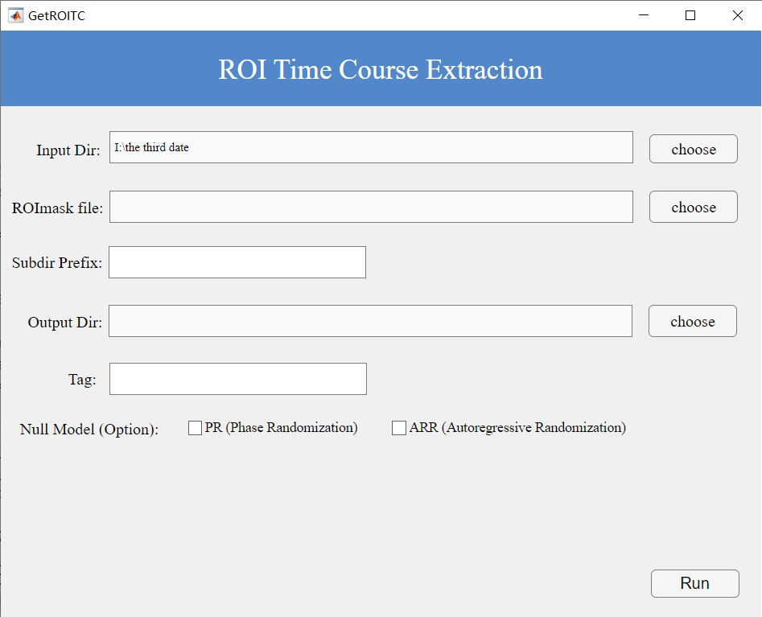

<center style="font-weight: 700">Figure 2. ROI Time Course Extraction Interface</center>


Subject data should follow the **BIDS** standard (Figure 3):

- Each subject (e.g., `sub01`, `sub02`) has a dedicated folder containing fMRI files (preprocessed) in a `func` subdirectory.
- Folder names must share a common prefix (e.g., `sub`).

​			              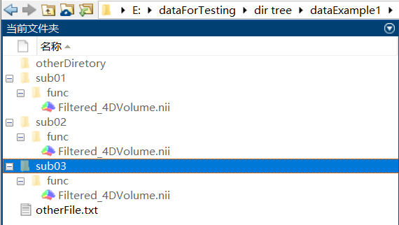

<center style="font-weight: 700">Figure 3. Input File Structure</center>

**Steps**:

1. **ROI Mask**: Select a mask file (must match fMRI voxel dimensions).
2. **Subject Prefix**: Enter the common prefix (e.g., `sub`); the interface will display the detected subject count (Figure 4).
3. **Output Path**: Specify a save location.
4. **Tag**: Assign a descriptive label for the ROI mask.
5. **Optional**: For resting-state data, enable **Phase Randomization (PR)** or **Autoregressive Randomization (ARR)** to generate null models (for validating dynamic FC). The software will generate corresponding null model results and store them in the PR or ARR subfolders. If your goal is to verify whether the dynamic functional connectivity (DFC) in resting-state data is merely the result of sampling variability in static FC rather than genuine dynamic changes, you can check this option. For details, please refer to the paper: [Liégeois, R.; Laumann, T. O.; Snyder, A. Z.; Zhou, J.; Yeo, B. T. T. Interpreting Temporal Fluctuations in Resting-State Functional Connectivity MRI. *NeuroImage* **2017**, *163*, 437–455.](https://doi.org/10.1016/j.neuroimage.2017.09.012) 


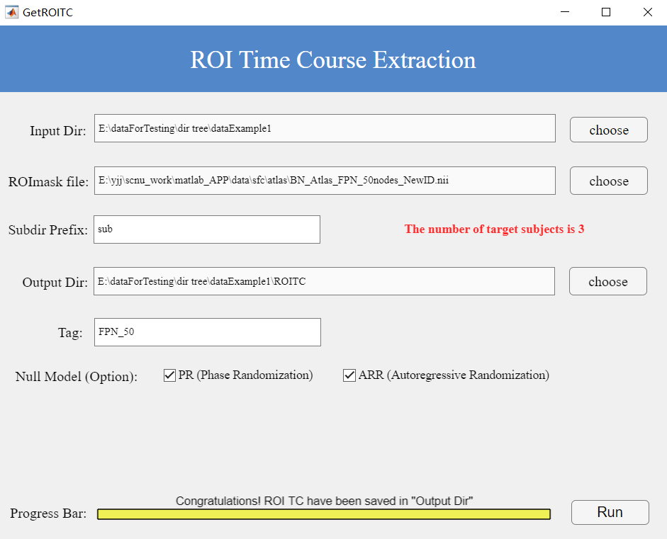

<center style="font-weight: 700">Figure 4. Example Input for Data Extraction</center>

After correctly entering all required parameters as described above, click the "Run" button to execute the process. Upon successful completion, as shown at the bottom of Figure 4, you will be notified that the results have been saved to your specified output folder.

For each subject, a corresponding .mat file containing the ROI time series will be generated. This file contains a two-dimensional matrix where:

- Rows represent the number of time points
- Columns represent the number of ROIs

If you have selected the null model option, additional subfolders (PR or ARR) will be automatically created to store the generated null model data. The output structure is illustrated in Figure 5.

Note: The software will preserve all original data while creating these additional null model datasets when the corresponding option is enabled.

​                  		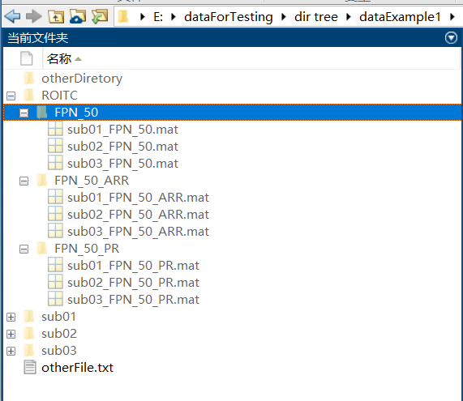

<center style="font-weight: 700">Figure 5. ROI TC Output Files</center>

### **3.2 Method Selection Module**

The method selection module includes two analytical approaches: ROI-based methods and grey matter voxel-based methods.

#### **3.2.1 ROI-Based Methods**

The toolbox implements 10 dynamic analysis methods for ROI-based approaches:

**Core Dynamic Methods:**

* Dynamic Conditional Correlation (**DCC**)
* Sliding-Window Functional Connectivity with L1-regularization (**SWFC**)
* Flexible Least Squares (**FLS**)
* Generalized Linear Kalman Filter (**GLKF**)
* Multiplication of Temporal Derivatives (**MTD**)

**Enhanced Inter-Subject Versions:**

* Inter-Subject DCC (**ISDCC**)
* Inter-Subject SWFC (**ISSWFC**)
* Inter-Subject FLS (**ISFLS**)
* Inter-Subject GLKF (**ISGLKF**)
* Inter-Subject MTD (**ISMTD**)

**Static Method:**

- Static Functional Connectivity (**SFC**)


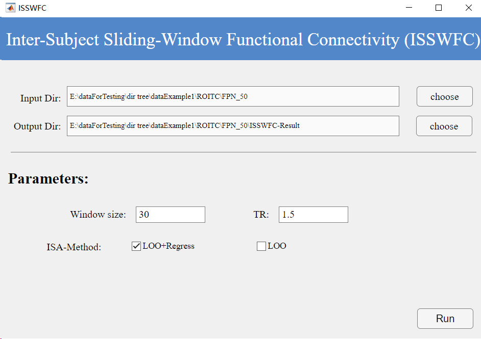

<center style="font-weight: 700">Figure 6. ISSWFC Interface</center>

**Workflow:**

##### **1. Input Path Selection**

- **Path Requirement**: Select the folder containing outputs from Step 1. **Note**: The selected directory must not contain any other `.mat` files unrelated to the analysis.

##### **2. Output Path Specification**

- **Options**:
  - Manually specify a custom save path.
  - Use the default path (as shown in Figure 6).

##### **3. Parameter Input Rules**

- **For SFC (Static Functional Connectivity)**: No additional parameters required. Proceed directly to execution.
- **For Other 10 Methods**: Mandatory parameter input (see Figure 6). Below are detailed descriptions:

------

**Method-Specific Parameters**

**1. DCC (Dynamic Conditional Correlation)**

- **TR (Repetition Time)**:
  - Definition: Time interval between consecutive fMRI volume acquisitions.
  - Value Range: Must be >0.
  - Unit: Seconds.

##### **2. SWFC (Sliding-Window Functional Connectivity)**

- **winSize (Window Size)**:
  - Definition: Duration of the sliding window for dynamic FC calculation.
  - Unit: TR
  - Typical Range: [20, 40] TRs.
  - Constraints: Must be >1 and < total TR count.
- **TR**: As above.

##### **3. FLS (Flexible Least Squares)**

- **mu (Penalty Weight)**:
  - Definition: Regularization coefficient balancing model fit and smoothness.
  - Default: 100.
- **TR**: As above.

##### **4. GLKF (Generalized Linear Kalman Filter)**

- **pKF (Model Order)**:
  - Definition: Lag order of the multivariate autoregressive (MVAR) model.
  - Value: Positive integer.
- **ucKF (Update Constant)**:
  - Definition: Adaptive noise covariance adjustment factor.
  - Range: [0, 1].
- **TR**: As above.

##### **5. MTD (Multiplication of Temporal Derivatives)**

- **MTDwsize (Smoothing Window)**:
  - Definition: Window size for averaging MTD raw values to reduce noise.
  - Unit: TR.

------

**Inter-Subject Analysis (ISA) Parameters**

**Applicable to Enhanced Methods (ISDCC/ISSWFC/ISFLS/ISGLKF/ISMTD)**

- **ISA-Method**: Two options:

  1. **LOO (Leave-One-Out)**:
     - Workflow:
       - For each subject, exclude their data and compute group mean (`LOO-Mean`, size: `nT × nROI`).
       - Concatenate subject’s original data (`nT × nROI`) with `LOO-Mean` → Final input (`nT × 2nROI`).
  2. **regressLOO (Regression-Adjusted LOO)**:
     - Workflow:
       - Perform linear regression between original data (`nT × nROI`) and `LOO-Mean`.
       - Subtract residuals to remove spontaneous/non-neural signals (e.g., scanner noise, physiological artifacts).
       - Output: Task-evoked time series (`nT × nROI`).

  - **Purpose**: Enhances spatiotemporal consistency **(see Chen et al., 2024, Brain Connectivity)**.

------

##### **Output File Structure**

- **SFC Results**:
  - Format: Individual `.mat` files per subject.
- **Dynamic Methods (DCC/SWFC/FLS/GLKF/MTD & ISA variants)**:
  - Format: Single `_all.mat` file containing:
    - All subjects’ results.
    - Method parameters.
    - Used as input for Clustering & Visualization (Step 3).
- **Example Output**: See Figure 7.

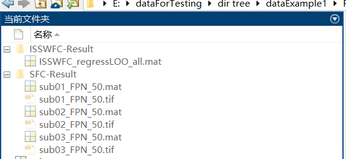

<center style="font-weight: 700">Figure 7. ROI Method Output</center>

#### **3.2.2 **Grey Matter Voxel-Based Methods

Four voxel-level methods are implemented:

- Co-Activation Patterns (**CAP**)
- Inter-Subject CAP (**ISCAP**)
- Inter-Subject Correlation (**ISC**)
- Sliding-Window ISC (**SWISC**)

Data Input Specifications

1. **fMRI Data Requirements**
   - Must follow **BIDS** directory structure: `subXX/func/`
   - Each subject's fMRI scans stored in individual subject folders
   - Example: `sub01/func/fmri_data.nii.gz`

2. Motion Parameter Handling (for CAP/ISCAP)**: Compliant with CAP_TB Toolbox Storage Specifications
   * Format: Plain text files with `.txt` extension
   * Temporal requirement: Must precisely match fMRI scan duration
   * Default behavior: System assumes zero motion when files are absent
   * Note: **Only required for CAP/ISCAP** analyses (optional for ISC/SWISC)

​                           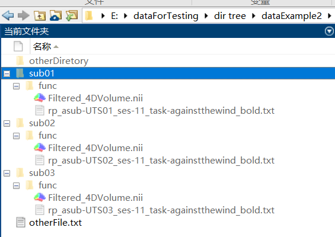

<center style="font-weight: 700">Figure 8. Input Structure for Voxel-Based Methods</center>


##### **ISC Workflow** (Figure 9):

1. **Input Directory**: Path to organized subject data.
2. **Grey Matter Mask**: Must match fMRI voxel dimensions.
3. **Subject Prefix**: Enter common prefix (e.g., `sub`). Since all subject folders follow a standardized naming convention with the common prefix 'sub', simply entering this prefix will automatically display the number of identified subjects in the interface.

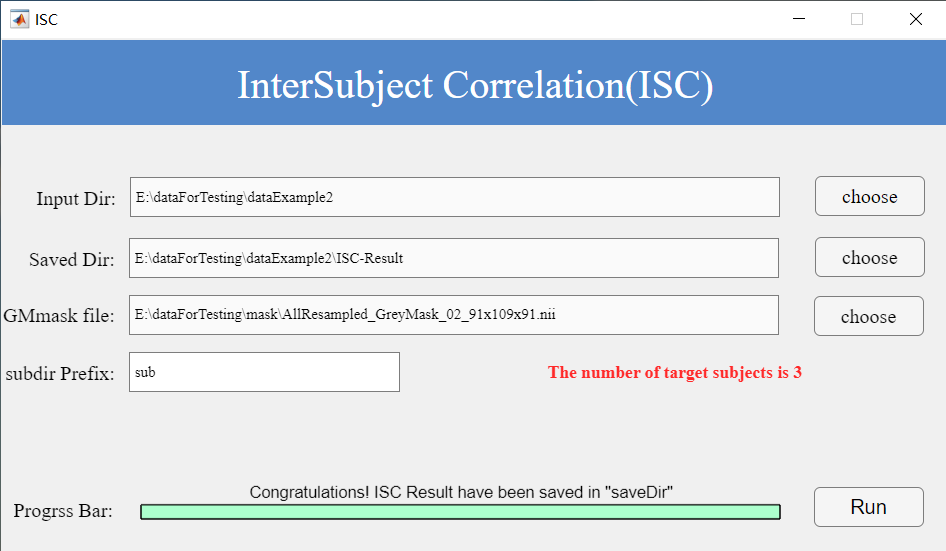

<center style="font-weight: 700">Figure 9. ISC Interface</center>

Two 3D NII files per subject (raw ISC and Fisher’s Z-transformed). With [BrainNet Viewer](https://www.nitrc.org/projects/bnv/) installed, `.tif` images are also generated (Figure 10).

​                                  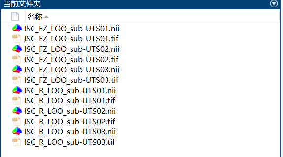

<center style="font-weight: 700">Figure 10. ISC Output</center>

##### **ISCAP Workflow** (Figure 11)

(1) After organizing the data according to the rules shown in Figure 8, set the data directory as the input path.

(2) Select a gray matter mask with voxel dimensions matching the source data.

(3) Since subject folders follow a consistent naming pattern with the common prefix 'sub', simply enter this prefix and the interface will display the number of detected subjects.

(4) Then input appropriate ISCAP parameters on the page:

- RunName: Identifies the current subject group dataset.
- Tmot: Motion threshold; frames exceeding this value in motion files will be excluded.
- K: Number of clusters (typically 1-12).
- TR: Repetition Time.
- pN/pP: Percentage of positive/negative voxels retained for clustering (range: [1,100]); remaining voxels are set to zero.

​			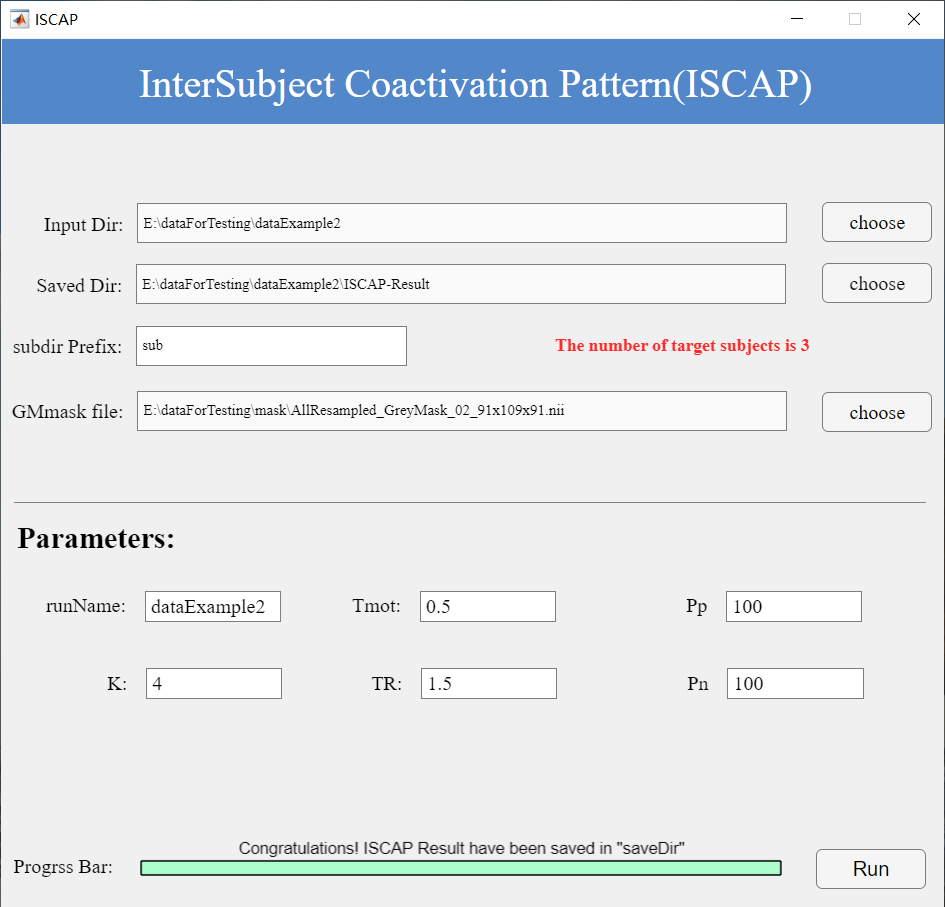

<center style="font-weight: 700">Figure 11. ISCAP Interface</center>

After entering these parameters correctly, click Run. Upon successful execution (as shown at the bottom of Figure 11), results will be saved in the specified output folder. Each subject's ISCAP results include:

- Two 3D NII files: raw ISCAP results and Z-scored versions.
- A state transition matrix (.mat file) with corresponding visualization.
- Proportion of each state across all subjects after clustering
- Transition probabilities between states
- Correlation of state sequences for each subject

As shown in Figure 12, if [BrainNet Viewer](https://www.nitrc.org/projects/bnv/) is installed in MATLAB, each 3D file will generate a corresponding TIF image.

​       					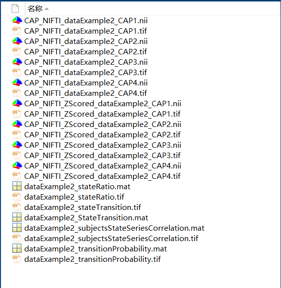

<center style="font-weight: 700">Figure 12. ISCAP Output</center>

### 3.3. Clustering and Plotting Module

This interface consists of four components: data input, optimal K value calculation, K-means clustering analysis, and visualization (Figure 13).

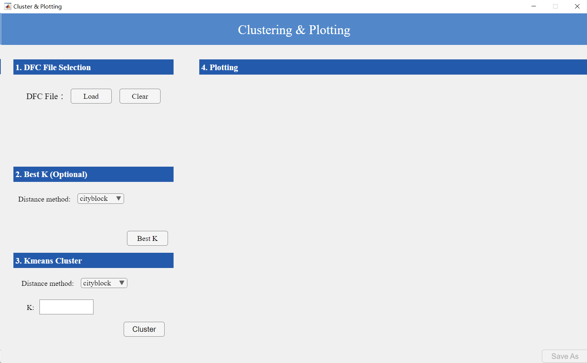

<center style="font-weight: 700">Figure 13. Clustering and Plotting Interface</center>

1. **Data Input**: Users need to input files ending with **_all.mat**, which contain results from dynamic ROI analysis methods (file location shown in Figure 7). The interface will display file details automatically.

2. **Optimal K Calculation**: Select a distance metric for clustering and click "Best K" to compute and display the optimal K value.
3. **K-means Clustering**:

- Use either the computed optimal K or manually specify a K value
- Select a clustering distance metric
- Click "Cluster" to perform K-means clustering and generate the following visualizations (Figure 14):
  - K state matrices (size: nROI × nROI)
  - State transition matrix (size: nSub × nT; x-axis in seconds, max = nT × TR)
  - Proportion of each state across all subjects
  - Transition probabilities between states
  - Correlation of state sequences for each subject (matrix size: nSub × nSub)

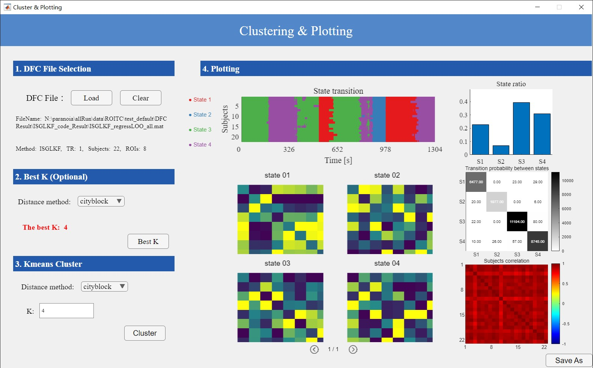

<center style="font-weight: 700">Figure 14. Clustering and Plotting Results</center>

**Output**:

- Saved visualization images
- Dynamic functional connectivity (DFC) variability for each subject (saved in "variability" folder)
- An output file (Figure 15)

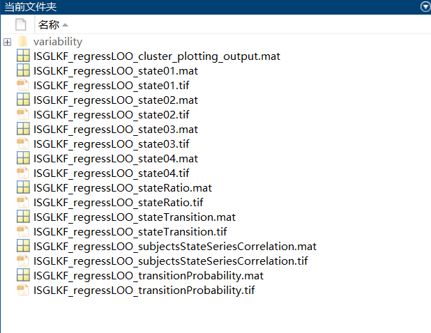

<center style="font-weight: 700">Figure 15. Output Data from Clustering and Plotting</center>

The **_output.mat** file contains:

- info: Input data information
- plotting: Source data for visualizations (K clustered state matrices, subject correlation matrices, state proportions, transition probabilities)
- clusterInfo: Clustering parameters (distance metric, K value)
- stateTransition: State transition matrices for all subjects
- median: Median DFC values per subject
- mean: Mean DFC values per subject
- variability: DFC variability per subject