# Naturalistic-Dynamic-Network-Toolbox(NaDyNet)


## **一.** 软件概述

NaDyNet是一款基于MATLAB的GUI软件，适用于分析自然刺激下的任务态fMRI数据（也适用于静息态fMRI数据）。旨在推动自然场景神经科学的发展。

自然刺激是指内容丰富且连续的刺激，如看电影或听故事。自然刺激是当前脑科学研究中的一种新兴范式。不同于组块或者事件相关设计，连续刺激fMRI信号很难基于GLM进行分析。NaDyNet提供了能够实时分析脑网络和激活的动态分析方法。

此外，任务态fMRI信号包括任务诱发成分，自发活动成分（占绝大比例），以及非神经成分（头动等）。本软件的创新点是在前人动态分析方法基础上，引入被试间分析方法（inter-subject correlation），开创了增强版本的方法，消除自发活动和非神经信号的影响。

NaDyNet提供了K均值聚类分析，求出最佳的K, 并且可视化聚类出的多种状态和相对应的状态转移矩阵。

## 二.软硬件环境要求

### **1.** **硬件要求**

该工具箱是分析fMRI（功能性磁共振成像）数据的一款MATLAB软件，由于fMRI数据比较庞大，因此要求内存至少大于等于16G。其中SWISC, CAP, ISCAP对内存的要求比较大，需准备更大的内存，如paranoia数据集，有22个被试，每个被试的nii文件有1310帧，需准备128G才可以运行。其他方法对内存要求不高。

对于其他硬件要求，只需要你的电脑可以打开并运行MATLAB 2018a或之后的版本即可

### **2.** 软件要求

为了能顺利的运行该MATLAB工具箱的相关功能，除了以上的硬件环境以外，还需要一定的软件支持。所需要的软件环境：

1. 操作系统：Windows 7 及以上

2. 网络环境：无要求

3. 运行平台：MATLAB 2018a及其之后的版本

4. MATLAB环境： 要求必须安装以下工具包

   (1) Medical Imaging Toolbox: 这是MATLAB 官方的一款自带的工具包，专门用于图像的处理。(一般是安装MATLAB时自带，在命令行输入如下命令, 如果显示出对应的路径则无需下载该工具包)

   ```matlab
   >> which niftiread
   C:\Program Files\MATLAB\R2022b\toolbox\images\iptformats\niftiread.m
   ```

   

   (2) [SPM](https://www.fil.ion.ucl.ac.uk/spm/software/download/): 在本工具箱中用于读写和操作fMRI文件。

   (3) [Group ICA Of fMRI Toolbox (GIFT)](https://github.com/trendscenter/gift)：用于对数据的结果进行分析。

   (4) [BrainNet Viewer](https://www.nitrc.org/projects/bnv/)： 在本工具箱中用于对3D的NII文件进行可视化，并且保存为图片。如果你无需将3D的NII文件进行可视化和保存的话，这一步是可选的。

   (5) [DCC](https://github.com/canlab/Lindquist_Dynamic_Correlation): 

   (6) [GLKF](https://github.com/PscDavid/dynet_toolbox):

   (7) [CAP_TB](https://c4science.ch/source/CAP_Toolbox/):

   以上2-7依赖的软件包可以在他们对应的超链接进行下载，如果无法下载，可以通过 [该链接](https://pan.baidu.com/s/1Fw_xOWI4y7hVJtVafRQWPQ?pwd=k2tm) 进行一次性下载。

安装完 本工具包 和 以上所提及的工具包之后，需要在Matlab-主页-设置路径，将这些Matlab工具包所在路径全部添加进去，后续只需要在matlab命令行输入以下命令，即可打开本软件使用。

```matlab
NaDyNet
```

如果你觉得输入上述命令繁琐，本GUI也提供简便命令

```matlab
NDN
```


## **三.** 软件功能和界面

软件主界包括三部分，分别为数据提取模块、方法选择模块和聚类与绘图模块，如图1所示。

在数据提取模块中，我们可以将一组被试的fMRI文件按照一定的规律存放到一个文件夹下，选择一个自己选定的感兴趣区掩模，即Regions of Interest(ROI) mask。提取这组被试的ROI的时间序列存放到自己设定的保存路径下。

在方法选择模块中，可分为基于感兴趣区的分析方法(ROI Method)和基于灰质体素的分析方法(Grey Matter Voxel Method)。在本软件中，如果你选择了基于灰质体素的分析方法，你是无需进行第一步的ROI时间序列的提取的。

 

1) 基于感兴趣区的分析方法（ROI Methods）：这种方法聚焦于预先定义的感兴趣区域（ROI）进行动态脑网络分析。

2) 基于灰质体素的分析方法(Grey Matter Voxel Method)：这种方法在整个大脑或灰质内，以体素为单位进行分析。

3）聚类与绘图模块：你可以通过Best K这一功能求出最佳的K值，或者自己设定一个K值，让本工具将动态的脑网络分析方法的结果进行一个聚类，最终得出K个聚类中心（状态），并将这K个状态在界面上可视化，同时将这一组被试的状态转移矩阵绘制出来。


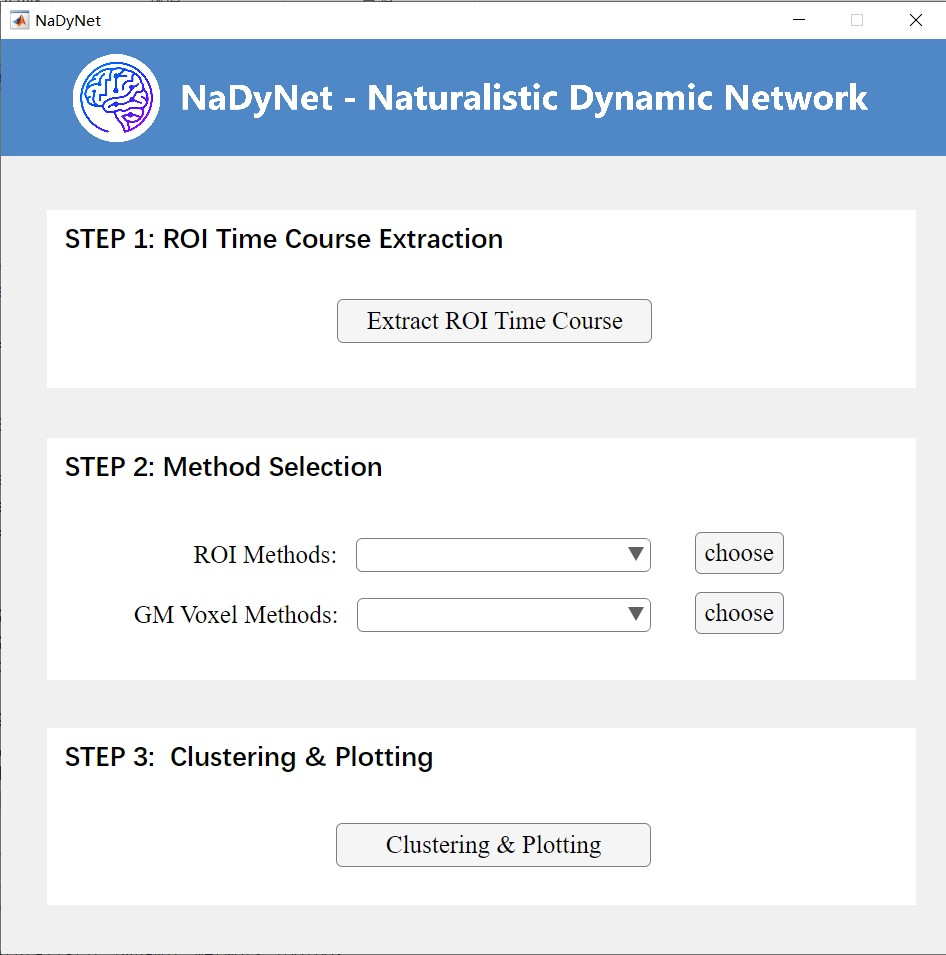

<center style="font-weight: 700">图一 软件主页面</center>

### 3.1 数据提取模块

在主界面的Step 1中，通过点击Extract ROI Time Course 按钮，可以进入到数据提取模块的界面。界面如下图所示：

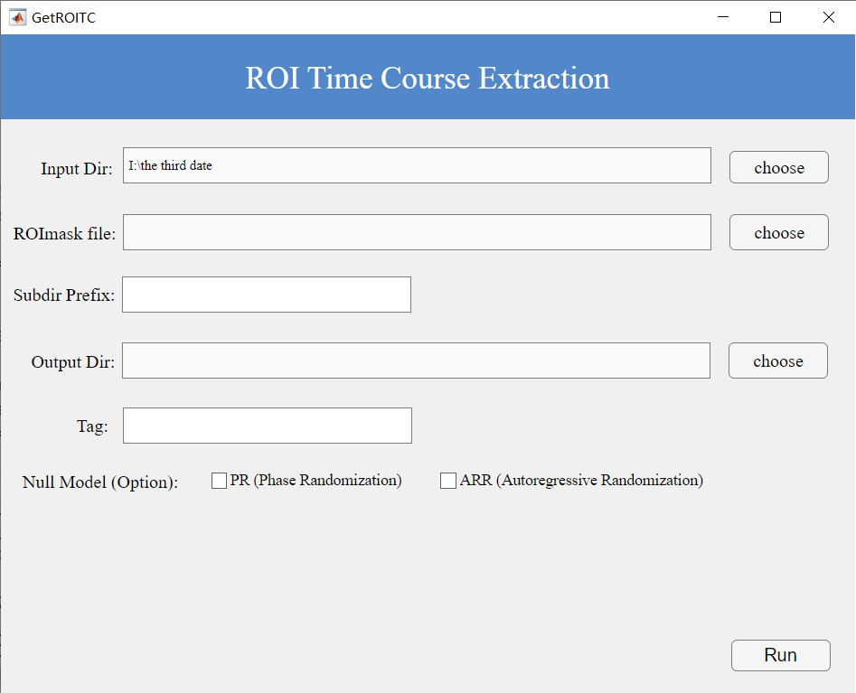

<center style="font-weight: 700">图二 ROI时间序列提取页面</center>


首先，我们数据的组织形式应该如下图所示，当前的目录下，有3个被试，分别为sub01、02、03，对于每一个被试对应的fMRI文件（预处理后）应当符合BIDS的要求，存放到一个单独的文件夹（sub-xx）下的func文件夹，并且每个文件夹命名要有一定规律，例如都是以字符串‘sub’开头，这样做的目的是为了排除其他无关的文件和文件夹。

​			                       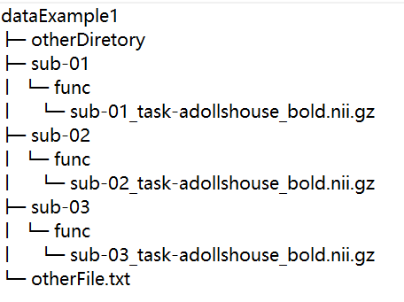


<center style="font-weight: 700">图三 输入文件组织方式</center>

第二，我们可以自己选择一个ROI mask文件，作为一个掩模用来提取特定区域的ROI信号。注意，这里的ROI mask文件的体素大小和形状应该同被试的fMRI保持一致，否则是会出错的。

第三，由于我们的被试的文件夹是按照一定的规律命名的，所以拥有共同的字符串前缀‘sub’，我们直需要输入正确的前缀，界面就会显示识别到了多少个被试，如图4所示，当前文件夹下的被试数量有3个。

第四，选个一个保存路径用于保存相应的结果

第五，由于ROI mask种类繁多，为了对后续分析造成不必要的混淆，所以输入一个可以辨别的标签Tag，提醒该ROI的时间序列是在哪一个ROI mask下得到的。

第六（可选的），对于静息态数据，你可以勾选（不是必须）相位随机化（PR）和自回归随机化（ARR）模型 - 生成稳定，线性，高斯空数据。该软件会生成相应的空数据模型的结果存放在PR或者ARR子文件夹下。如果你有以下目的：验证静息态的DFC是否只是静态FC的采样变异性（sampling variability）的结果，而不是真正的动态变化，就可以勾选，具体可参考文章:

[Liégeois, R.; Laumann, T. O.; Snyder, A. Z.; Zhou, J.; Yeo, B. T. T. Interpreting Temporal Fluctuations in Resting-State Functional Connectivity MRI. *NeuroImage* **2017**, *163*, 437–455.](https://doi.org/10.1016/j.neuroimage.2017.09.012) 

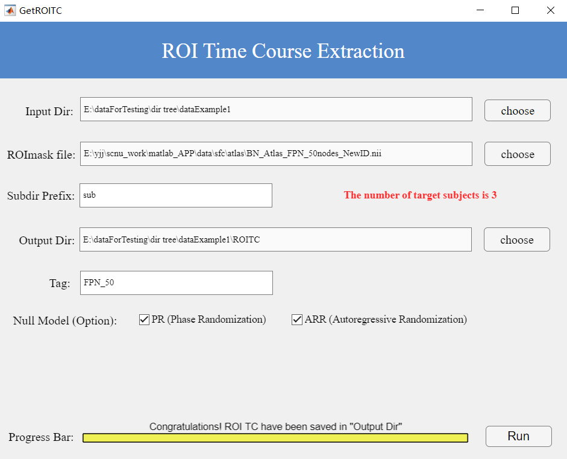

<center style="font-weight: 700">图4 数据提取页面输入示例</center>

当按照上述步骤正确输入之后，点击按钮Run即可运行，运行成功会如图4底部所示，告知你结果已经保存在你选定的目标文件夹下面。每一个被试的ROI时间序列会有一个对应的mat文件，这是一个二维矩阵数据，行数代表了时间点的个数，列数代表了ROI的个数。如果你勾选了相应的空模型参数，也会生成相对应的文件夹保存这些空模型数据。结果如图5所示。

​                  		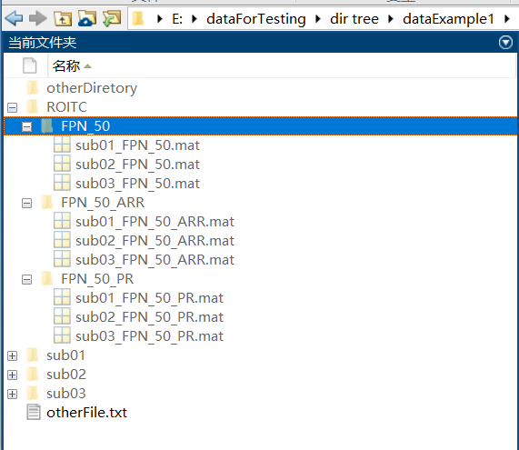

<center style="font-weight: 700">图5 数据提取页面输出内容</center>

### 3.2 方法选择模块

在方法选择模块中，包含了基于感兴趣区的分析方法(ROI Method)和基于灰质体素的分析方法(Grey Matter Voxel Method)。

#### 3.2.1 基于感兴趣区的分析方法

基于感兴趣区的分析方法本软件实现了**12**种方法，可以细分为动态方法和静态方法：
**10种动态分析方法：**

* 动态条件相关（dynamic conditional correlation, 简称DCC)
*  基于滑动窗口的动态功能连接(sliding-window functional connectivity with L1-regularization,简称SWFC)
* 灵活最小二乘法（flexible least squares,简称 FLS）
* 广义线性卡尔曼滤波器（general linear Kalman filter，简称 GLKF）
* 时间导数乘积（multiplication of temporal derivatives，简称 MTD）

及其5种对应的增强版本

* 被试间动态条件相关 （Inter-subject dynamic conditional correlation, 简称ISDCC)
* 基于滑动窗口的被试间动态功能连接(Inter-subject sliding-window functional connectivity with L1-regularization, 简称 ISSWFC)
* 被试间灵活最小二乘法（Inter-subject flexible least squares, 简称 ISFLS）
* 被试间广义线性卡尔曼滤波器ISGLKF （Inter-subject general linear Kalman filter，简称 ISGLKF）
* 被试间时间导数乘积（Inter-subject multiplication of temporal derivatives，简称 ISMTD)

**2种静态分析方法：**

* 静态功能链接（static functional connectivity, 简称SFC)。

* 被试间静态功能连接（Inter-subjectfunctional connectivity, 简称ISFC)。

  

接下来介绍如何使用这些方法。以基于滑动窗口的被试间动态功能链接ISSWFC这个方法为例子，如图6所示。

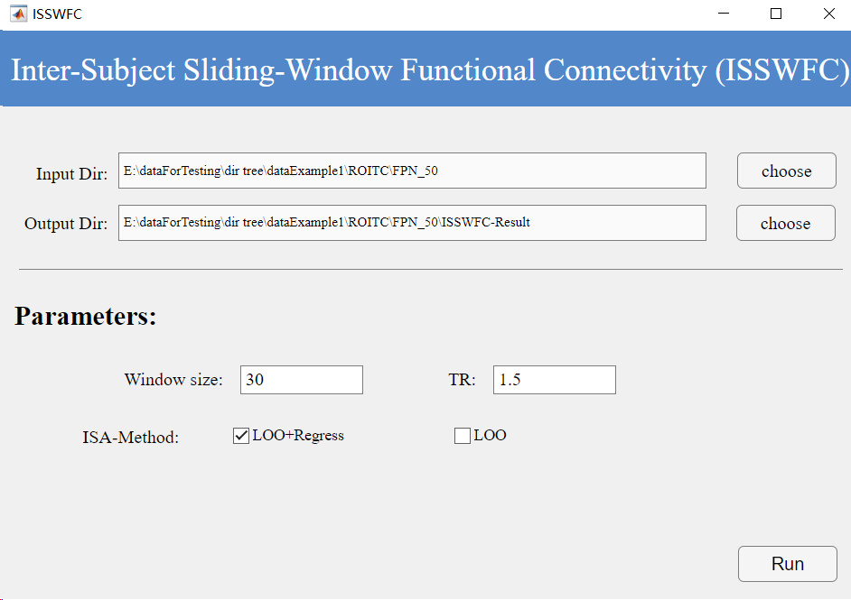

<center style="font-weight: 700">图6 ISSWFC界面展示图</center>

首先， 输入路径应该选择step1运行之后的结果所在的文件夹。**注意，该文件夹所在的路径不可以存放其他以.mat结尾的文件。**

第二， 保存路径可以自己选择或者像图6一样为默认路径。

第三， 对于无需输入的参数的方法静态功能链接SFC，则无需做第三步直接运行，否则需要跟图六一样填写相应的参数。除了SFC外，剩余的10种方法，都需要输入方法的参数才可以成功的运行。接下来介绍以下这些方法涉及的参数的含义。

1) DCC界面的参数包括了TR，TR 是指 Repetition Time，即重复时间，取值范围需大于0(下同)。

2) SWFC界面的参数包括了winSize和TR，winSize指的是动态功能连接中滑动窗口的大小，单位是TR，通常的取值范围在[20，40]个TR之间，其取值范围应大于1，小于总TR个数。

3) FLS界面的参数包括了mu和TR。mu代表penalty weights（惩罚权重）或者加权系数。默认值为100。

4) GLKF界面的参数包括了pKF、ucKF和TR。pKF：正整数，表示模型的阶数（即 MVAR 模型的滞后阶数）。ucKF：更新常数，用于自适应地更新噪声协方差矩阵。ucKF的取值范围通常在 [0, 1] 之间。

5) MTD界面的参数包括了MTDwsize。 MTDwsize 是一个用于平滑 MTD 值的参数，它通过在特定大小的窗口（以 TR 为单位）内对 MTD 原始值进行滑动窗平均，以减少噪声对分析结果的影响。

6) 对于剩下5种对应的增强版本，界面会显示多一个参数ISA-Method，值分别为LOO和regressLOO，你可以选择两个中的其中一个作为被试间的分析方法。

LOO, 将每个被试的源数据(维度为nT * nROI, nT代表时间点个数，nROI代表感兴趣区域个数)单独留出，使用剩余数据计算群体的平均值LOO-Mean(维度为nT * nROI），之后与源数据进行列拼接形成最终的输入数据(维度为nT * 2nROI）)。

regressLOO，是在LOO的基础上，对每个被试的源数据(维度为nT * nROI）与 LOO_Mean(维度为nT * nROI）	时间序列进行线性回归分析，通过去均值和添加截距项来调整数据，接着使用线性回归计算得到残差，并从原始数据中减去这些残差以去除自发活动和非神经活动的影响。最后，返回任务诱发数据的时间序列数据(维度为nT * nROI）。这样的数据可以大约认为回归掉了一些无关信号(如被试的自发信号、核磁共振设备的系统噪声、被试的生理噪声)，只剩下了自然刺激引发的大脑信号。

通过引入被试间的ISA分析，可以一定程度提升结果的在时间和空间上的一致性（可参考Chen et al., 2024, Brain connectivity）。

最后， 方法运行完成之后的结果都会保存在指定的位置下，如图7所示。对于**SFC**, 每一个人的结果都会对应一个以“.mat”结尾的文件。对于动态分析方法运行的结果，会输出一个以“_all.mat”结尾的文件里面包含了这一组被试所有的结果以及一些参数信息，作为第三步聚类和绘图模块的输入。

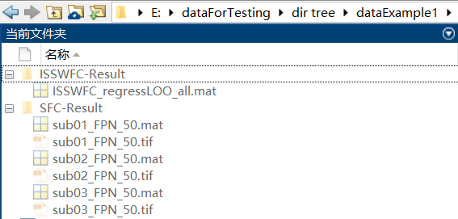

<center style="font-weight: 700">图7 ROI方法输出结果展示</center>


#### 3.2.2 基于灰质体素的分析方法

本软件实现了4种基于灰质体素的分析方法。

* 共激活模式分析 CAP
* 被试间共激活模式分析 ISCAP
* 被试间相关 ISC
* 基于滑动窗的被试间相关 SWISC

除了ISC是静态的方法，其余三种都是动态的。


首先，介绍以下输入文件的组织形式。我们数据的组织形式应该如下图所示，当前的目录下，有3个被试，分别为sub01、02、03，对于每一个被试应按照BIDS要求， 将对应的**fMRI文件**（支持.nii.gz 和 .nii结尾的文件）存放到一个单独的文件夹（如sub01）下的func文件夹。同时将相应的**头动文件**（支持.txt 和 .csv 结尾的文件）也放置在相同的位置，如果没有添加头动文件也可以运行，软件会默认为0头动。有一点需要注意的是这个**头动文件的时间长度**应该和**fMRI文件的时间长度**保持**一致**，否则会报错。头动文件必须以“.txt”结尾。并且每个被试的文件夹命名要有一定规律，例如都是以字符串‘sub’开头，这样做的目的是为了排除其他无关的文件和文件夹。如果选择ISC，SWISC方法的话，文件夹下面无需放置头动文件。

​                                         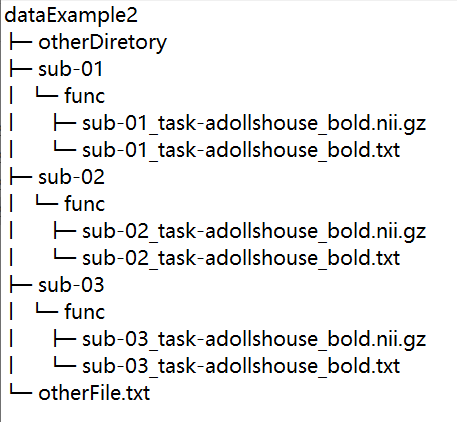    

<center style="font-weight: 700">图8 灰质体素的分析方法下输入数据的组织形式</center>

第二，被试间相关（ISC）的界面如图9所示。操作步骤如下：

（1）按照图8的规则组织好数据之后，就可以将数据所在的路径作为输入路径。

（2）并且选择一个体素和大小与源数据相对应的灰质掩模（mask）。

（3）由于我们的被试的文件夹是按照一定的规律命名的，所以拥有共同的字符串前缀‘sub’，我们直需要输入正确的前缀，界面就会显示识别到了多少个被试。

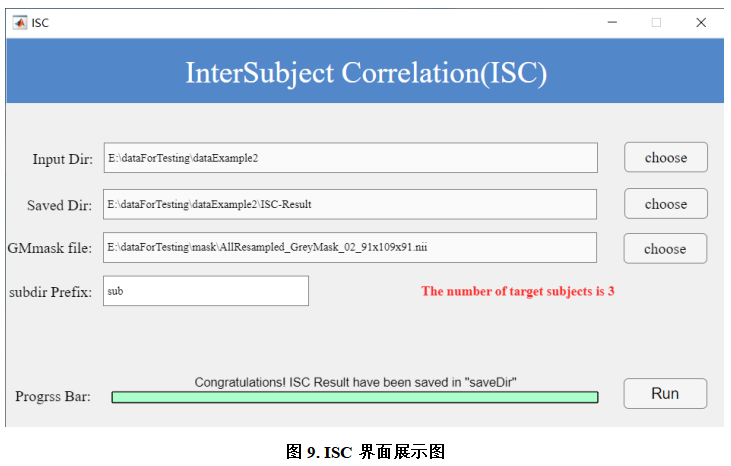

当按照上述的正确输入之后，点击按钮Run即可运行，运行成功会如图9底部所示，告知你结果已经保存在你选定的目标文件夹下面。每一个被试的ISC结果都会对应有两个3D NII文件，一个是ISC算出来的直接结果，另外一个是在此基础上做了一次Fisher's Z 变换。运行之后结果如图10所示，如果你在MATLAB添加了[BrainNet Viewer](https://www.nitrc.org/projects/bnv/)工具包，那么每一个3D文件都会生成一个相应的TIF图片。

​				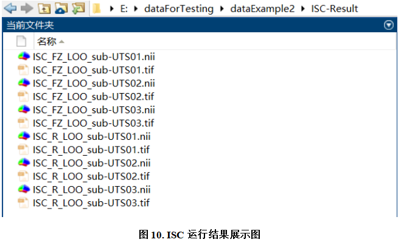

第三，被试间共激活模式（ISCAP）的界面如图11所示。操作步骤如下：

（1）按照图8的规则组织好数据之后，就可以将数据所在的路径作为输入路径。

（2）并且选择一个体素和大小与源数据相对应的灰质掩模（mask）。

（3）由于我们的被试的文件夹是按照一定的规律命名的，所以拥有共同的字符串前缀‘sub’，我们直需要输入正确的前缀，界面就会显示识别到了多少个被试。

（4）接下来就是在页面输入合适的ISCAP参数。参数runName可以用来标识当前这组被试的数据。Tmot作为一个头动阈值，软件会根据Tmot的数值和头动文件的内容用来筛出掉fMRI那些头动较大时的帧。K代表了聚类个数，一般K的输入范围在1-12。TR 是指 Repetition Time，即重复时间。pN, pP分别指定应保留用于聚类的正值和负值体素的比例（其余体素则设置为零）。pN, pP的取值范围是 [1，100]。

（5）求取最佳的K值，这一步采用的是共识聚类的方式，这一步需要运行很久，很费内存，自行决定是否需要运行。有如下参数：1. Kmax: 范围在【3，12】之间，确定最佳K的求取范围，最终本工具箱会在 【2， Kmax】这个范围求取最佳的K值。 2 Pcc:取值范围为[80, 100]的数值，表示需要保留的原始数据百分比，建议输入100，其他数值有可能报错，如果不报错也可以选择其他数字以减少计算量。 3. N：运行迭代次数。

求完最佳的K值，你可以将该值作为K的值，然后再点击Run运行ISCAP

​			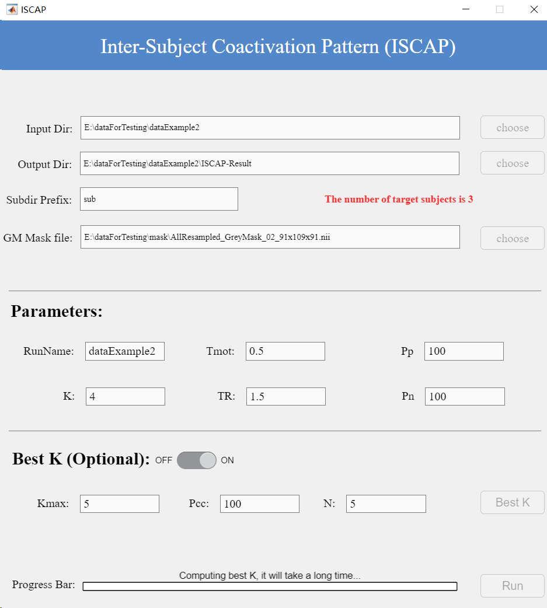

<center style="font-weight: 700">图11 ISCAP运行界面</center>

当按照上述的正确输入之后，点击按钮Run即可运行，运行成功会如图11底部所示，告知你结果已经保存在你选定的目标文件夹下面。每一个被试的ISCAP结果都会对应有两个 3D NII文件，一个是ISCAP算出来的直接结果，另外一个是在此基础上做了一次Z 分数。此外，还会生成一个状态转移矩阵的mat文件和相应的图片。

运行之后结果如图12所示，如果你在MATLAB添加了[BrainNet Viewer](https://www.nitrc.org/projects/bnv/)工具包，那么每一个3D文件都会生成一个相应的TIF图片。

​             				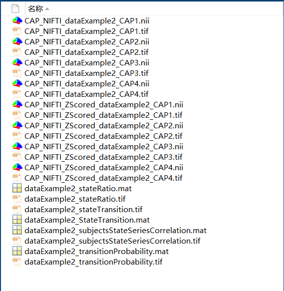

<center style="font-weight: 700">图12 ISCAP输出结果</center>

### 3.3. 聚类和绘图模块

在此页面中，可分为4部分，分别为数据输入、求最佳K值、K均值聚类分析和绘图，如图13所示。

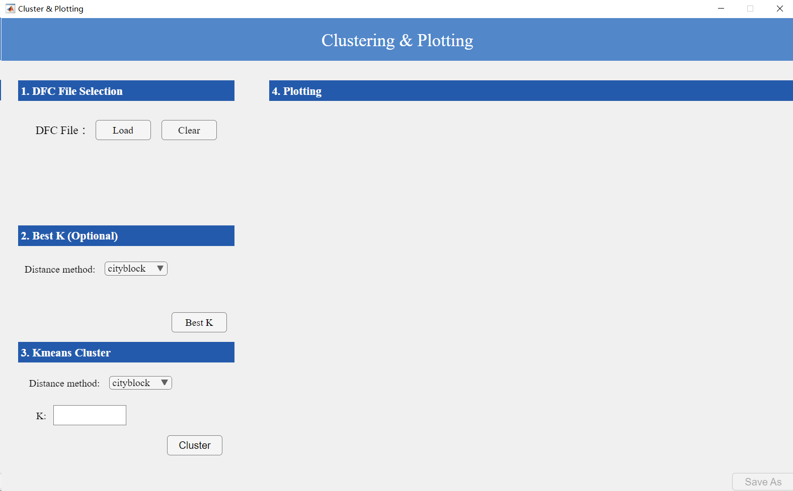

<center style="font-weight: 700">图13 聚类与绘图界面</center>

首先是输入输入，用户只需要输入以**"_all.mat"结尾**的文件，页面即可显示文件的详情信息。该**“_all.mat”**结尾的文件是**动态ROI分析方法**运行输出的结果，该文件所在位置如图7所示。

第二，在最佳K值求解部分，用户选择一个求解聚类的距离方法。点击Best K按钮即可运行，运行之后界面会显示出最佳的K值。

第三，在K均值聚类分析的部分，用户可以使用上一步求出的最佳的Best K，或者输入自己想要的K值。同时选择一个求解聚类的距离方法，最后点击Cluster按钮即可进行K均值聚类并在右侧生成以下图片，如图14所示。。

* K个状态矩阵图（矩阵大小均为nROI * nROI，其中nROI代表n个感兴趣区域）
* 一个状态转移矩阵图（矩阵大小均为nSub * nT，其中nSub 代表n个被试，nT代表了时间窗口个数，不一定与被试的nii文件的时间长度相同，具体要看使用了什么动态的ROI方法和输入了什么参数。状态转移矩阵图的横坐标的单位为秒，所以x轴最大的时间为nT* TR）
* 所有被试聚类后各个状态的比例
* 各个状态之间的转移概率
* 每个被试的状态序列的相关性（矩阵大小均为nSub * nSub）

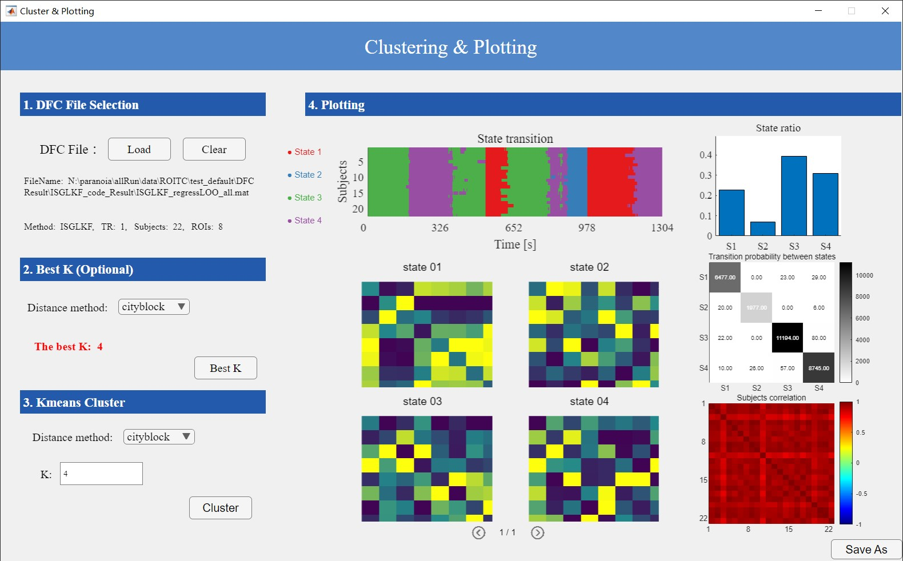

<center style="font-weight: 700">图14 聚类与绘图结果界面</center>

最后点击保存，除了会将图片结果保存下来，还会输出每个被试的DFC的变异性（保存在variability文件夹下）和一个output文件，如图15所示。

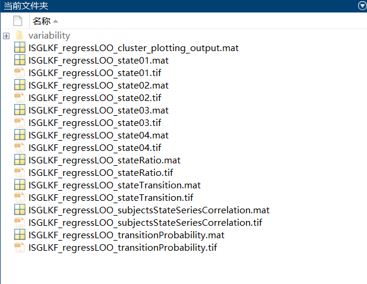

<center style="font-weight: 700">图15 聚类与绘图输出的数据</center>

其中**_output.mat**结尾的文件保存了以下信息：

* info 输入数据里的信息
* plotting 保存了输出图片的源数据，包括了聚类后的K个状态矩阵，被试的相关矩阵、每个状态的比例、状态之间的转移概率
* clusterInfo 聚类信息，包括了聚类使用的距离公式，K值
* stateTransition 所有被试的状态转移矩阵
* median 对于每一个被试，计算该被试的动态功能连接矩阵值的中位数
* mean  对于每一个被试，计算该被试的动态功能连接矩阵的平均值
* variability  对于每一个被试，计算该被试的动态功能连接矩阵变异性


